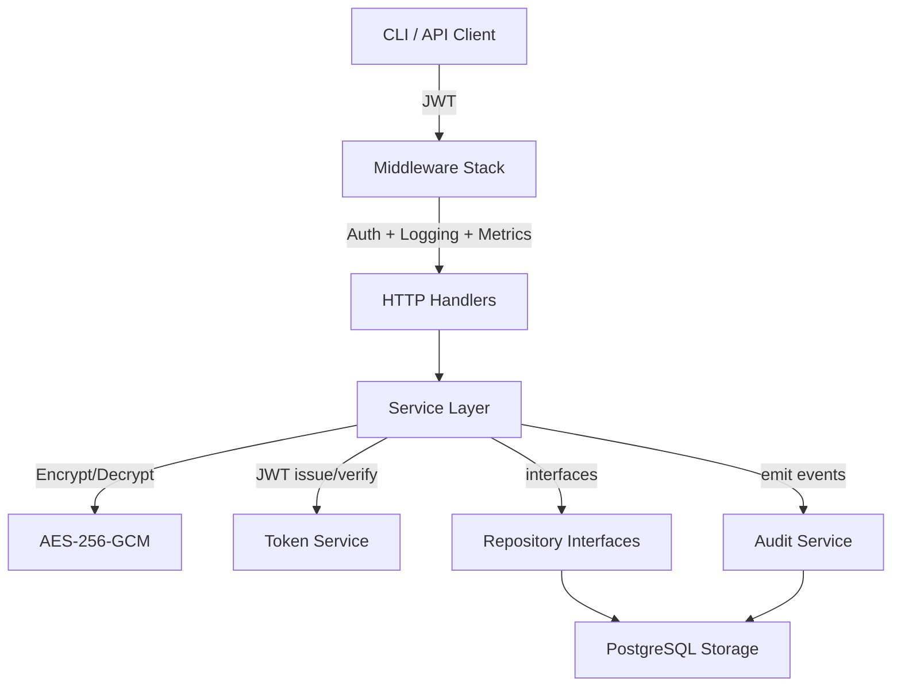

# Secret Service

> A self-hosted secrets management service for development teams — written in Go.
> Open-source alternative to HashiCorp Vault for small to mid-size teams.

[](https://golang.org)
[](https://www.postgresql.org)
[](https://www.docker.com)
[](LICENSE)

---

## What it does

Stores API keys, tokens, passwords, and connection strings in a central place — encrypted, versioned, and audited — and gives the right people the right access through a clean HTTP API and a CLI client.

Built for teams of 3–50 developers who outgrew `.env` files committed to git, but don't need (or can't afford) the operational complexity of running HashiCorp Vault.

---

## Why I built this

Most small teams handle secrets in one of three ways, all bad:

1. **`.env` files committed to private repos** — leaks the moment someone forks or makes the repo public by mistake
2. **Pasting secrets into Slack/Notion** — no rotation, no audit, no revocation
3. **Cloud secret managers (AWS / GCP)** — vendor lock-in, complex IAM, $0.40 per secret per month adds up fast

Vault is the right answer at scale, but its operational footprint is heavy for a 5-person startup. This service is the 80/20 — the features small teams actually need, in one binary you can run on a $5 VPS.

---

## Features

| | |
|---|---|
| **AES-256-GCM encryption** | Secret values encrypted at rest with authenticated encryption. Encryption key never touches the database. |
| **Versioning + rollback** | Every secret update creates a new version. Roll back to any previous version with one call. |
| **RBAC per project** | Three roles: `admin`, `manager`, `developer`. Granular control over who can read, rotate, or grant access. |
| **Time-bound access grants** | Give a developer temporary read access to a single secret that auto-expires. |
| **Service accounts for CI/CD** | Separate machine-to-machine auth with short-lived (1h) JWTs and explicit project scope. |
| **Environments + tags** | Split secrets by `development` / `staging` / `production`. Filter and group by tags. |
| **Full audit log** | Every action recorded with actor, project, secret, and structured metadata. Searchable via API. |
| **CLI client** | `ss login`, `ss secrets get`, `ss secrets set` — fits naturally into shell scripts and CI pipelines. |
| **Prometheus metrics** | `/metrics` endpoint exposes request rates, latencies, and error counts out of the box. |
| **OpenAPI / Swagger UI** | Auto-generated docs at `/swagger/`. |

---

## Architecture



**Design principles:**
- **Layered architecture**: domain → service → repository → handler. Each layer depends only on interfaces of the next.
- **No magic**: no codegen, no DI container. Constructor injection from `main.go`, easy to trace and test.
- **Testability**: integration tests run against a real PostgreSQL via [testcontainers-go](https://github.com/testcontainers/testcontainers-go).
- **Graceful shutdown**: SIGINT/SIGTERM handling with a 10-second drain.

```
cmd/
  server/         HTTP server entry point (wire-up)
  cli/            CLI client (cobra)

internal/
  domain/         Pure Go structs — no framework dependencies
  dto/            Request/response objects (HTTP layer)
  crypto/         AES-256-GCM encryption service
  token/          JWT issue + parse
  auth/           User auth (registration, login, password hashing)
  project/        Projects + RBAC
  secret/         Secrets + versioning
  access/         Time-bound access grants
  serviceaccount/ Machine-to-machine accounts
  team/           User groups for bulk project assignment
  audit/          Audit log
  admin/          Platform-level stats (admin-only)
  storage/        PostgreSQL implementations (sqlx)
  handler/        HTTP handlers (chi router)
  http/           Router + middleware registration
  middleware/     Auth, Logging, RequestID, Recovery, Metrics, RateLimit

migrations/       SQL migrations (auto-applied on startup)
docs/             Generated Swagger JSON/YAML
tests/            Unit + integration tests
```

---

## Quick start (5 minutes)

**Prerequisites:** Docker + Docker Compose.

```bash
git clone https://github.com/<your-username>/secret-service.git
cd secret-service

# Generate a 32-byte AES key (64 hex chars) and a JWT secret
export AES_KEY_HEX=$(openssl rand -hex 32)
export JWT_SECRET=$(openssl rand -hex 32)

docker compose up -d

# Server is up at http://localhost:8080
# Swagger UI at http://localhost:8080/swagger/

# Register the first user (becomes global admin automatically)
curl -X POST http://localhost:8080/api/v1/auth/register \
  -H "Content-Type: application/json" \
  -d '{"email":"you@example.com","password":"strongpassword123"}'
```

The CLI is in `cmd/cli` — build with `go build -o ss ./cmd/cli`.

```bash
./ss login --email you@example.com
./ss projects create --name "my-app"
./ss secrets set --project my-app --name DATABASE_URL --value "postgres://..."
./ss secrets get --project my-app --name DATABASE_URL
```

---

## Security model

This is a secrets service — the security model deserves its own section.

**Encryption.** Secret values are encrypted with AES-256-GCM before they touch the database. The encryption key is passed via `AES_KEY_HEX` environment variable and never persisted. Lose the key, lose the data — bring your own KMS for production.

**JWT keys.** Two distinct token classes:
- User tokens: HS256, 24h TTL, subject `user`
- Service-account tokens: HS256, 1h TTL, subject `service_account`, scoped to a specific project

**Access check chain** (for `GET /secrets/{id}/value`):
```
1. Secret status == 'active' AND not expired?
2. User is a member of the parent project?
   → yes: allow
3. Does an active access_grant exist for (secret, user) AND not expired?
   → yes: allow
4. Deny + emit audit event `secret_read_denied`
```

**Audit log is append-only at the application level** — no API exists to delete audit events. (At the database level, defence in depth requires Postgres-level controls — see Production considerations below.)

**Rate limiting** on `POST /auth/register` and `POST /auth/login` to slow down credential stuffing.

---

## API overview

Full reference: see [DOCUMENTATION.md](./DOCUMENTATION.md) (1500+ lines).

| Endpoint group | Purpose |
|---|---|
| `POST /api/v1/auth/register`, `POST /api/v1/auth/login` | User auth |
| `GET / POST / PATCH / DELETE /api/v1/projects` | Project CRUD |
| `GET / POST / PATCH / DELETE /api/v1/projects/:id/secrets` | Secret CRUD |
| `GET /api/v1/secrets/:id/value` | Read decrypted secret value (audited) |
| `POST /api/v1/secrets/:id/versions` | Rotate (creates a new version) |
| `POST /api/v1/secrets/:id/rollback/:version` | Roll back to a previous version |
| `POST /api/v1/secrets/:id/grants` | Grant time-bound read access |
| `GET /api/v1/audit` | Search audit log |
| `GET /metrics` | Prometheus metrics |
| `GET /swagger/` | Interactive API docs |

---

## Testing

```bash
# Unit tests (crypto, token)
go test ./tests/unit/...

# Integration tests — spins up a real PostgreSQL via testcontainers
go test ./tests/integration/...
```

Integration tests cover the full HTTP → service → DB path. They start PostgreSQL in a Docker container, run migrations, and exercise the real handlers via `httptest.Server`.

---

## Production considerations

Honest list of what you'd need to harden this for a real production deployment:

- **Bring your own KMS** for the AES key. Don't keep it in plain env vars at scale — use AWS KMS, GCP KMS, or Vault Transit and load on startup.
- **TLS termination** in front of the service (nginx, Caddy, or a cloud load balancer). The service speaks plain HTTP.
- **Database-level append-only audit** — at the application level the audit log has no delete endpoint, but a Postgres superuser can still tamper. For regulated environments, use trigger-based append-only enforcement or ship audit events to an external append-only store.
- **Backup the encryption key separately from the database.** A database backup without the key is useless. A database backup with the key in the same place defeats the encryption.
- **Secret rotation policy** — the service supports versioning, but doesn't automate rotation. Pair with an external cron / scheduler.

---

## Tech stack

- **Language:** Go 1.25
- **HTTP router:** chi v5
- **Database:** PostgreSQL 14+ with sqlx
- **Auth:** JWT (HS256) + bcrypt password hashing
- **Crypto:** AES-256-GCM (stdlib)
- **CLI:** cobra
- **Observability:** structured logging (slog), Prometheus metrics
- **Docs:** Swagger / OpenAPI (swaggo)
- **Tests:** testify-style stdlib tests + testcontainers-go

---

## About

Built by Alexandr Gorlyshkov as a graduation project at Ural Federal University, 2026.

I'm available for backend engineering contracts — Go, Python (FastAPI), and Node.js. Particularly interested in security-sensitive services, fintech integrations, and devtools.

- Email: [a.gorlyshkov@gmail.com]
- LinkedIn: []
- Portfolio: []

If you're building something where this kind of code would be useful, let's talk.

---

## License

MIT — see [LICENSE](LICENSE).
